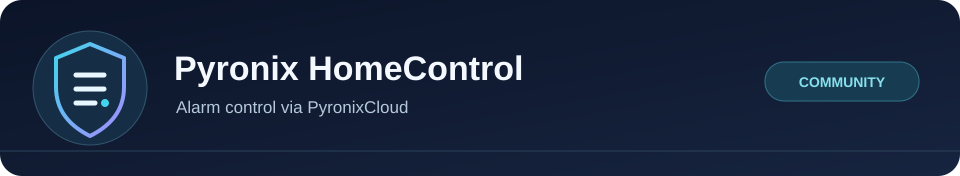

<div align="center">



# Pyronix HomeControl for Home Assistant

Connect to your Pyronix alarm through Home Assistant without leaving BlueStacks running.

[](LICENSE)
[](#install-the-integration)

[How it works](#what-it-does) | [Install](#install-the-integration) | [Set up](#connect-your-own-alarm) | [Safety and limits](#safety-and-limits) | [Troubleshooting](#if-something-goes-wrong) | [Development](#development)

</div>

## What it is

This custom integration connects directly to PyronixCloud and opens an encrypted
session with the alarm panel. It exposes each area as a Home Assistant alarm
control panel, with explicit Connect and Disconnect buttons. BlueStacks is used
only to obtain setup details from your own signed-in HomeControl 2.0 app.

The project is at an early stage. A real login and area status reads have been
verified with HomeControl 2.0 app **6.3.0** and panel firmware **2.11**. Arming
has worked on the maintainer's panel. The current connection flow and disarming
still need a physical user trial; automated control tests use a simulated panel.
Compatibility with other panels and app versions is unconfirmed.

## What it does

1. Press **Connect** to open an encrypted session and read the current area states.
2. Choose an area, enter your **Pyronix user code**, then arm or disarm it.
3. Press **Disconnect** when you finish. This closes the connection; it does not disarm the alarm.

Connect and Disconnect stay available when the areas are unavailable. The **Connection** sensor shows whether HA is disconnected, connecting, connected or has encountered an error. After a failed connection, close any other live app connection and press Connect again.

The same connection carries status updates and commands. There is no background polling or automatic connection at startup. A session closes after five minutes without a Connect press or alarm command; the Connection sensor includes its expiry time. While disconnected, the areas are unavailable because Home Assistant cannot verify their current state. Their names are retained across restarts, but old states are never presented as live.

The area named `Night Set` uses Home Assistant's **Arm night** action. Other areas use **Arm away**. Each action applies only to that area. There is no “arm everything” action, forced omissions, outputs or installer settings.

Home Assistant waits for a panel response before reporting success. **Setting** appears as **Arming**, with later status arriving over the open connection. If a command is not confirmed within 25 seconds, Home Assistant reports an uncertain outcome. A late response can still update the displayed state. The integration never repeats an arm or disarm command automatically, even after a lost connection. Check the real panel before trying again.

An unfamiliar panel state appears as unknown. “Cannot Set” and “Can Override” mean an area is disarmed but cannot be armed normally. The reason appears in its `panel_status` attribute, and arming is refused while either state is present.

## Safety and limits

- The integration depends on PyronixCloud and an available panel. It is not an
  offline or local network connection.
- A timeout does not prove an arm or disarm command failed. Confirm the real
  panel state before trying again.
- Areas show as unavailable while disconnected. Do not use an unverified area
  state as the sole trigger for a safety-critical automation.
- The verified hardware and app versions are listed above; other combinations
  need their own checks. This is independent community software, not an official
  Pyronix or Home Assistant product.

## Before starting

You need a working HomeControl 2.0 account, a panel that connects successfully in the app, its separate **user code** and **app password**, and access to your HA configuration folder. The integration uses the Pyronix cloud service; it is not an offline LAN integration.

The documented setup uses BlueStacks on Windows to obtain connection details
from your own signed-in app. The helper does not need Android root access. App
versions that stop exposing those details in their process log will need
another setup method.

## Install the integration

1. Download this repository using **Code → Download ZIP**, then extract it.
2. Copy `custom_components/pyronix_homecontrol` into your HA `/config/custom_components/` folder. The result should include `/config/custom_components/pyronix_homecontrol/manifest.json`.
3. Restart Home Assistant.

This is a manual installation; there is no HACS release. Tests cover Home
Assistant 2026.7.1 and 2026.9.1 fixtures, with import and startup checks on a
development system.

## Connect your own alarm

1. Install Python 3.11 or later on the computer running BlueStacks. The setup helper only uses Python's standard library.
2. Sign in to **HomeControl 2.0** in BlueStacks.
3. Enable **Android Debug Bridge** in BlueStacks settings. Leave root access off. Note its loopback address and port; these can differ between installations.
4. Open your alarm system in HomeControl. Enter its user code and app password, then wait until its areas are visible.
5. In HA, open your user profile's **Security** page and create a temporary **Long-lived access token** for setup.
6. Open a terminal in the extracted repository and run the command below. Replace the system name, ADB port and HA address with your own values.

```powershell
python tools/setup_from_adb.py --system-name "My alarm" --device "127.0.0.1:5555" --ha-url "http://homeassistant.local:8123"
```

7. Enter the **Pyronix user code** and the temporary **HA access token** at the hidden prompts. Do not put either in the command itself.
8. Close the live panel screen in HomeControl. Open **Settings → Devices & services → Pyronix HomeControl** in HA and press **Connect**. Check the area states before trying a control.
9. Delete the temporary HA token. The integration does not need it after setup. You can close BlueStacks and turn its debugging option off again.

The helper looks for ADB on your PATH or in the usual BlueStacks installation folder. If necessary, add `--adb "C:\path\to\HD-Adb.exe"` to the command.

The helper reads only the HomeControl process log, selects the system name you supplied and sends the required fields to your HA setup flow. It does not print or save those fields. It also stops its own temporary ADB server. HA stores the resulting connection details in its normal integration configuration, so treat HA backups as private.

## Add controls to a dashboard

Add the **Connection** sensor and **Connect** / **Disconnect** buttons to your dashboard. Then add an **Alarm panel** card for each Pyronix area you want to use. Enter the **Pyronix user code** when arming or disarming. This integration does not change any separate PIN you use for HA notifications or tablet kiosks.

The panel may refuse to arm when a detector is open or a fault needs attention. I leave that decision with the panel. I have not enabled forced arming or automatic alarm schedules.

## If something goes wrong

- **No matching connection found:** reopen the selected system in HomeControl, wait for the areas to load and run the helper again. Match the system name exactly.
- **ADB cannot connect:** check that debugging is enabled and use the address and port for the correct BlueStacks instance.
- **Integration unavailable:** restart HA after copying the files. Check that the folder was not nested twice.
- **Panel busy or offline:** close the live panel screen in the phone app and check its network connection. Press **Connect** to try again. Press **Disconnect** in HA before opening a live connection in the phone app.
- **Reconnecting immediately fails:** the cloud has sometimes reported that the panel is not polling immediately after Disconnect, then accepted a connection about 35 seconds later. Wait briefly and press **Connect** again. The buttons remain available after an error.
- **Credentials changed:** use **Reconfigure** on the integration and enter the new app password and user code.
- **Command timed out:** check the real panel or app before trying again. A timeout does not prove the command failed.

Do not upload app logs, access tokens, connection details or HA backups to an issue. A description of the problem, versions and the fixed error message is enough to start.

## Development

Run the Home Assistant tests in an isolated Linux environment with Python 3.14:

```sh
python -m venv .venv
. .venv/bin/activate
pip install -r requirements-dev.txt
ruff check .
ruff format --check .
pytest -q
```

The tests use synthetic credentials and a simulated panel. They cover the encrypted handshake, fragmented messages, area permissions, HA services, wrong codes, lost acknowledgements, live updates, heartbeats, idle expiry and connection controls while offline. They do not arm a real alarm.

This project is available under the [MIT licence](LICENSE). For bugs, use
[GitHub Issues](https://github.com/Herbertmt978/HA-Pyronix/issues)
after removing credentials, tokens, connection details and private alarm data.
